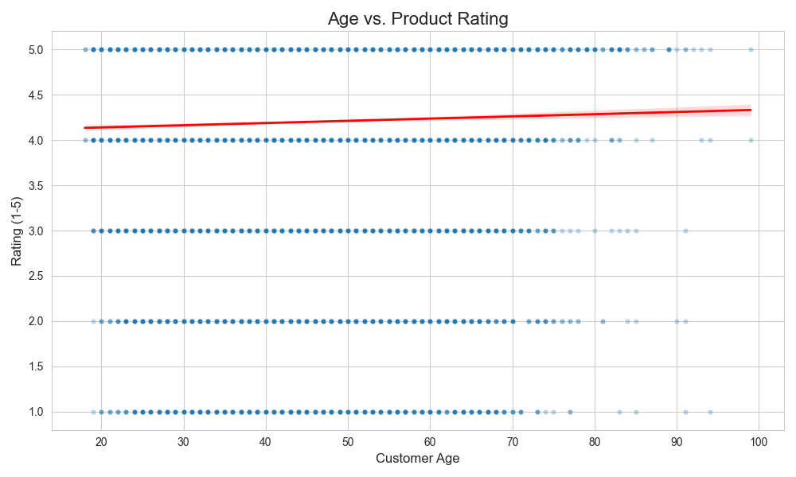
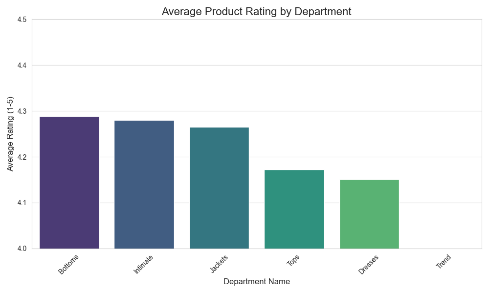
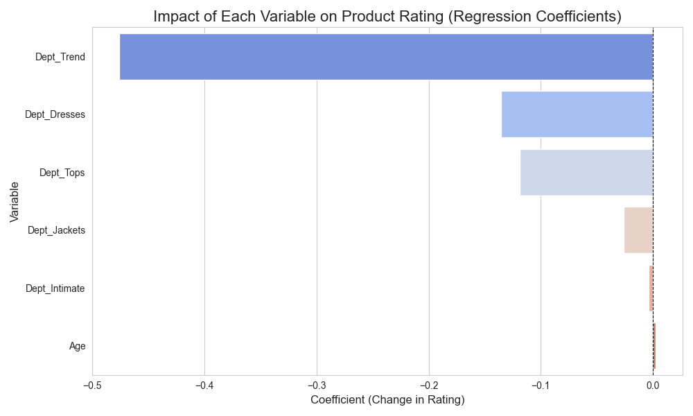

# E-Commerce Customer Rating Analysis

This is a data analysis project to identify the key drivers of customer satisfaction by analyzing e-commerce reviews. The goal was to move from raw customer data to actionable business recommendations.

The analysis was performed using Python (Pandas, Scikit-learn, and Matplotlib) in a Jupyter Notebook.

---

### The Business Question

In e-commerce, customer ratings are a direct measure of satisfaction. A key challenge for any Product Manager is to understand *why* some products receive low ratings. This project investigates the question:

**"To what extent can a product's rating be predicted by the customer's age and the product category?"**

Answering this allows the business to stop guessing and make data-driven decisions about where to focus improvement efforts: on the *product* (inventory, quality) or on the *marketing* (targeting, demographic mismatch).

### Key Findings & Insights

The analysis involved cleaning the dataset of 23,000+ reviews and building a multiple linear regression model. The results were clear and conclusive.

#### Finding 1: Customer Age is NOT a Significant Predictor of Rating

The model showed that `Age` has a coefficient of `+0.0025`, meaning its impact on a 5-star rating system is negligible. The scatter plot below confirms this: there is no clear linear relationship between age and rating.

**Insight:** The team should *not* waste resources trying to segment users by age to predict satisfaction. The problem is not with the demographic targeting.

#### Finding 2: Product Department IS a Significant Predictor of Rating

The model identified that the product's department is a major factor. Specifically, the **"Trend"** department has a massive negative coefficient (`-0.476`), indicating that products in this category are, on average, rated almost a **full half-star lower** than other products.

This is visualized in the bar charts below, which show the "Trend" department with the lowest average rating and the regression model confirming it as the most significant negative factor.

| Average Rating by Department | Regression Model Coefficients |
| :---: | :---: |
|  |  |

### Actionable Business Recommendation (The "So What?")

The data provides a clear directive:

**The business should immediately prioritize a deep-dive investigation into the "Trend" department.**

The "half-star" rating deficit is a systemic failure, likely due to poor product quality, inaccurate descriptions, or a fundamental mismatch in user expectations. This data-driven insight allows the product and merchandising teams to focus their resources on the single biggest source of customer dissatisfaction instead of wasting time on irrelevant factors like customer age.

---

### Repository Contents

* `code1.ipynb`: The Jupyter Notebook containing all Python code for the data cleaning, analysis, and visualization.
* `Womens Clothing E-Commerce Reviews...csv`: The raw dataset used for the analysis.
* `Assignment 2.pptx`: The original presentation of these findings.
* `age_vs_rating_scatter.png`, `average_rating_by_department.png`, `regression_coefficients.png`: The exported visualization outputs.
* `.gitignore`: Ignores Jupyter Notebook checkpoint files.
